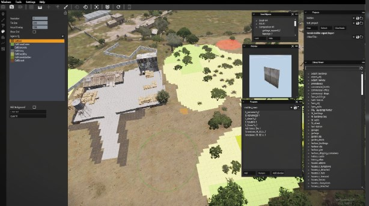

Pythia
======

[](https://github.com/overfl0/Pythia/actions/workflows/build.yml)

An Arma 3 extension that lets you to write python extensions for Arma 3. And it's really simple and straightforward to
use!

[Pythia's Discord server](https://discord.gg/Pp6ac56).

TL;DR:
------

Create a function:
```python
def my_function(some_string, number, the_truth):
    return ['awesome', 42, True, (1, 3.5)]
```

Call it from Arma:

    ["MyAwesomeModule.my_function", ["arg1", 3.14256, False]] call py3_fnc_callExtension

This will return this to your SQF code:

    ["awesome", 42, True, [1, 3.5]]

What Pythia does NOT do:
------------------------

Pythia does NOT replace SQF for modding Arma. You will still have to call your
Python code from SQF.

If you're looking for something to extend Arma just like with C++ extensions
(access \[remote\] files, databases, generate images, perform advanced
computations) but in Python, then Pythia is the right tool for you!

Features:
---------

- Full type conversion both ways: pass in an SQF array of ints, get a python array of ints. Return a tuple of a float,
a bool and a string, get an SQF array containing the float, bool and the string
- Embedded python installation (you don't have to install anything; just run the mod)
- Python code stored inside `@YourOwnMod` directory
- Python modules can call and reuse each other, even between separate Arma mods
- Background Python threads
- Cython and other compiled python extensions "just work" (C-like speed for performance-critical modules)
- Extendable python environment through pip
- Proven to work with libraries such as numpy, scipy, matplotlib, PyQt5, etc...
- Automatic python code reloader for easier development
- Calling SQF back from Python (experimental, using asyncio syntax)
- Allows returning more than 10240 characters from the extension transparently
- Annoys sloppy SQF developers with correct code indentation since Day One ;)

#### Potential features

These features could be implemented quite easily but for some reason have never been done. Want them in or want to help
developing them? Contact the developers!

- Mods contained inside single .pbo files
- Calling functions in the background and polling for them

Example mods:
-------------

The following are mods that use Pythia to accomplish their goal.

### Frontline

<p align="center">
   
</p>

[Frontline](https://steamcommunity.com/sharedfiles/filedetails/?id=882328821) is like *Squad* but done in Arma. Like *Project Reality: Arma 3* but better. With
 a *Dynamic Frontline* feature that moves as you conquer terrain (and a bunch of other features).

The frontline computation is done in Python, with the use of `numpy`, `scipy`, `matplotlib` and custom `Cython` code.

### ObjectPlacementTBH

<p align="center">
   
</p>

It's just a tool for object placement, to be honest... ;)

Pythia is used for loading in xml files, file IO, writing images using `PIL`, loading layers.cfg (using [Armaclass](https://github.com/overfl0/Armaclass)).
The newest version is using `PyQt5` to [display Qt widgets over the Arma window](https://www.youtube.com/watch?v=Jt4eFG1sM50).

Status
------

Current status: Finishing touches before 1.0. You can use it right now - it's stable. Yes, really.

If you are serious about using Pythia, see [the issues page](https://github.com/overfl0/Pythia/issues) and especially
[this one](https://github.com/overfl0/Pythia/issues/9). You can contact me to ask for planned changes, on [Pythia's
Discord server](https://discord.gg/Pp6ac56). I don't bite :).

Example usage
------

Your directory structure:
```
@MyAwesomeMod/
├── Addons/  # (...)
└── python_code/  # Can be named however you want; you can have more than one
    ├── $PYTHIA$  # Contains the name of your python package, for example: MyAwesomeModule
    ├── __init__.py
    ├── module.py
    ├── cython_module.cp37-win_amd64.pyd  # Compiled Cython code, because we can!
    └── cython_module.cp37-win32.pyd      # Same code but for 32-bit Arma
```

`__init__.py`:
```python
def my_function(my, arguments):
    return ["awesome", 42, True, (1, 2)]
```

`module.py`:
```python
from .cython_module import stuff  # You can import code from other modules, obviously

def call_stuff():
    return stuff()
```

Now run Arma 3 with `-mod=@Pythia;@MyAwesomeMod` and execute the following:

---

*Console:*

    ["MyAwesomeModule.my_function", [3.14256, False]] call py3_fnc_callExtension

*Result:*

    ["awesome", 42, True, [1, 2]]

---

*Console:*

    ["MyAwesomeModule.module.call_stuff"] call py3_fnc_callExtension


*Result:*

    ["Hello world from a Cython module!"]

*Note: `MyAwesomeModule` is the string that was in the `$PYTHIA$` file. You can use any string you want here,
obviously.*

Performance:
------------

The code is written with performance in mind, meaning that function lookups are cached to limit the number of
`getattr`s, for example. However, keep in mind that the accessibility requirements (SQF <=> Python type conversion) and
the general overhead caused by BIs design choice of allowing passing only strings to `callExtension` must take its toll.
I'm open to implementing an alternate set of restricted commands that swap convenience for speed, if required, though...

As such, it is suggested to limit the number of python calls in each frame. It is still faster to call one function with
two sets of arguments than two functions, one right after the other.

#### Concrete numbers:

The test below was executed by calling `pythia.ping` with different types of arguments, meaning that each list of
arguments had to be converted to python and the return value had to be converted back to SQF. Each test was conducted 3
times and the lowest value was written down.

The exact arguments for each test can be found on [the scratchpad](https://github.com/overfl0/Pythia/wiki/Scratchpad).

|  #  | Type of arguments | 10 arguments | 100 arguments |
| --- | ----------------- | :----------: | :-----------: |
|  1  | Integers          | 0.0198 ms    | 0.0858 ms     |
|  2  | Floats            | 0.0225 ms    | 0.1091 ms     |
|  3  | Booleans          | 0.0155 ms    | 0.0580 ms     |
|  4  | Strings           | 0.0161 ms    | 0.0580 ms     |
|  5  | Arrays with ints  | 0.0318 ms    | 0.2086 ms     |
|  6  | Empty arrays      | 0.0153 ms    | 0.0555 ms     |

Note that you will probably usually pass a number of arguments lower than 10 (and if you don't, your function will most
probably be slower than the (de)serializing overhead) so you can assume that **each Pythia call takes around 0.02 ms**
on a recent computer.

This allows for **under 150 Pythia calls per frame** if you want to stay under the 3ms arbitrary limit (arbitrary
because the callExtension calls are not really limited by the engine, they just block execution until finished).

*Note: You may get away with calls that take even 100 ms server-side, if they happen rarely enough.*

*Note: If your code is REALLY big and slow consider using a background Python thread. See below.*

Your own mod development
========================

Code reloader
-------------

*Note: The reloader currently only works for native python code!*
*If your code uses Cython or custom C extensions (dll/pyd files) you will get errors when reloading.*

To turn the reloader on, simply call:
```
["pythia.enable_reloader", [True]] call py3_fnc_callExtension
```

The reloader will then watch all the imported Pythia modules for changes and if any source file is updated, **every
loaded module** will be reloaded on the next Pythia call. Builtin python modules and modules installed with pip are
exempt from reloading.

**Important: objects in the global namespace will stay as they are. If such an object points to data inside a module,
that data will point to the old (not reloaded) module instance, even after the reload!** (the module will not be
garbage-collected as long as there is something pointing to it).

This can lead to situations where you have two instances of the same module loaded in-memory. The recommended way is to
create pre_reload/post_reload hooks for your module and reinitialize your new module and global variables with the data
from the old module, on reload. See below.

#### Keeping your module data between reloads

To prevent losing data during reload your module needs to have `__pre_reload__` and `__post_reload__` hooks declared.
`__post_reload__(state)` will be called with the exact same arguments as have been returned by `__pre_reload__()` before
reloading the module.

The reloader works as follows: (simplified pseudo-python code)
```python
def reload_all_modules():
    for module in pythia_modules:
        modules_state[module.__name__] = module.__pre_reload__()

    reload_modules(pythia_modules)

    for module in pythia_modules:
        module.__post_reload__(modules_state[module.__name__])
```

Creating those functions is purely optional.

Note that using the reloader causes a time penalty for each call and shouldn't be used in production.

Threads
-------
TODO

Calling SQF back from Python
----------------------------
TODO

Note that you need to be comfortable with using asyncio-type code to use this feature!

Installing
----------

- Subscribe to it [on Workshop](https://steamcommunity.com/workshop/filedetails/?id=1751569185), or...
- Get a [prebuilt version from Github](https://github.com/overfl0/Pythia/releases), or...
- Build the mod yourself
- Copy `@Pythia` to `Arma 3` directory
- (Optional for development) Create a `python` directory in `Arma 3` directory. Put all your python functions there


#### Installing Python requirements

If any of your Pythia mods contains a `requirements.txt` file, simply drag it onto `@Pythia\install_requirements.bat` to
install all the requirements to both python installations before running the game.

Pythia development
==================

Building requirements
---------------------

- Any Python 3 installation
- Visual Studio Community 2019
- WSL2 with Docker installed and configured
- MakePBO

Building
--------

#### First-time build:

Run this on Windows (requires WSL2 to be installed and configured!)

    python tools\rebuild_all.py

This will fetch and install all the python interpreters required both for
building Pythia and then used by Pythia itself at runtime. See `build.py` which
is used by `rebuild_all.py` for details.

#### Later, for modifying and building the DLLs/SOs:

- In Visual Studio: File -> Open -> CMake: `CmakeLists.txt`, Build -> Build All. Remember to build for all
  configurations!

#### Later, for building everything else:

- `python tools\build.py --help`
- See `rebuild_all.py` for usage

Contributing
------------

All contributions are welcome! Is something in the documentation unclear? Feel free to submit a PR or drop a note on
[Pythia's Discord server](https://discord.gg/Pp6ac56).
